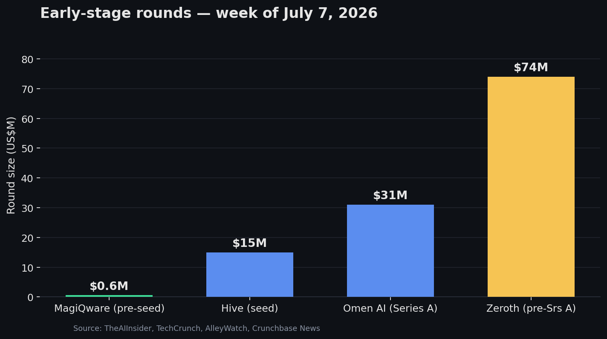

# The Week in Seed: Capital Is Buying Machines Senses

### Week of July 7, 2026 — this week's early-stage money had one throughline: physical AI

Strip the logos away and almost every early-stage round that surfaced this week was funding the same idea from a different angle — giving physical machines the ability to sense, decide, and act. Not chatbots. Not another AI wrapper. Sensors, brains, and bodies for the equipment that runs the real economy. Here's the week read as **investment themes**, with each company broken down the way you'd underwrite it.

---

## Theme 1 — Physical AI for the real economy

The dominant thesis of the week, and arguably the year. Analysts size the broader "physical AI" market at roughly **$81B in 2025, scaling toward ~$1.1T by 2035** (Kaiso Research, ~33% CAGR) — the convergence of cheap sensors, edge compute, and vision-language-action models applied to machines rather than screens. Three of this week's rounds sit squarely inside it.

### Hive — $15M seed (led by SuperSeed)

- **Problem:** Industrial machines — excavators, forklifts, production-line equipment — are blind. Operators run them reactively, replacing parts on fixed schedules and eating unplanned downtime.
- **Product:** A "silicon brain" — software you retrofit onto existing equipment so it can perceive its surroundings, decide, and act. Claims of cutting productive machine-hour costs by up to 80%.
- **Customer:** Owners of industrial fleets across warehouses, production lines, and construction — retrofit-first, so no need to buy new hardware.
- **Stage:** Seed. Investors: SuperSeed (lead), Veriten, Skyfall Ventures, Nysnø; angels incl. Medallia's Børge Hald and Meltwater's Jørn Lyseggen.
- **TAM:** Industrial slice of physical AI / automation — tens of billions today, on the ramp toward the $1T+ physical-AI figure by 2035. Retrofit (vs. rip-and-replace) widens the serviceable market to the *installed base*, not just new machines.
- **Moat:** If the retrofit approach truly works across heterogeneous equipment, the data flywheel (proprietary machine-behavior data across fleets) is the defensible asset — not the software itself.

### Omen AI — $31M Series A (led by Nava Ventures)

- **Problem:** Liquid-cooled AI data centers and heavy machinery are monitored by mailing fluid samples to a lab and waiting days. A coolant problem caught late means flushing a rack — 5–6 hours offline, millions per incident.
- **Product:** Inline spectroscopic sensors (plus a portable diagnostic unit) that attach to a machine's fluid system and continuously read metal content, bio-contamination, and wear — advance warning before failure.
- **Customer:** Liquid-cooled data centers (named: TensorWave, an AMD-based AI cloud) and industrial fleet operators (Carolina CAT / Caterpillar dealers). Disclosed base: data centers representing ~$200B in assets, 10–14 GW of capacity.
- **Stage:** Series A ($31M; $41.5M total). Founded 2024 by a 20-year-old founder. ~a dozen data-center customers — thin, and unclear how many are paid vs. pilots.
- **TAM:** Rides the data-center buildout — global capacity is projected to nearly double to ~200 GW by 2030 (McKinsey), with liquid cooling becoming default — plus industrial predictive maintenance. A picks-and-shovels position under the AI capex wave.
- **Moat:** An investor-customer validation loop (diligence ran *through* large customers) and a strategic cap table — Mann+Hummel, Johnson Controls, Bridgestone execs — that can double as distribution. Competitor Pyxis just shipped a rival product, so the moat is timing + channel, not the sensor alone.

### Zeroth — ~$74M pre-Series A

- **Problem:** General-purpose humanoid robots need a path into the home — the hardest, least-structured environment for embodied AI.
- **Product:** Home-focused embodied-AI humanoids (China-based).
- **Customer:** Early consumer / home market, with the usual near-term reality that structured industrial settings monetize first.
- **Stage:** Pre-Series A — but ~$74M, which is the story: growth-stage capital at a nominally early stage. Robotics is where investors are paying up before revenue.
- **TAM:** The widest error bars on this list. Today's humanoid market is ~$2–3B; forecasts run from **$38B by 2035 (Goldman Sachs)** to **$200B (Barclays)** to **$5T by 2050 (Morgan Stanley)** — scope-dependent and unproven. Underwrite it as an option on a category, not a spreadsheet.
- **Moat:** In humanoids, moat = manufacturing supply chain (Asia's advantage) + real-world operating data + capital endurance. At pre-Series A, mostly the last one.

---

## Theme 2 — Deep-tech infrastructure (the long-duration bets)

Smaller checks, longer horizons, deeper science. The counterweight to the applied physical-AI rounds — capital still flows to decade-long technical bets at the earliest stage.

### MagiQware — €575K pre-seed

- **Problem:** Fault-tolerant quantum computing needs a software layer that today barely exists; hardware progress is outrunning the tooling to use it.
- **Product:** AI-driven software for fault-tolerant quantum computing.
- **Customer:** Quantum hardware groups and, eventually, enterprises running quantum workloads — a research-led buyer for now.
- **Stage:** Pre-seed (€575K) — the smallest check of the week, a classic European deep-tech science bet.
- **TAM:** Genuinely uncertain. Quantum computing is a few billion dollars today; long-run (2035–2040) estimates span ~$10B to $100B+ depending entirely on what's counted. High-variance, high-optionality.
- **Moat:** Deep technical IP and team, and being early to a software layer that becomes essential *if and when* fault-tolerant hardware arrives. Timing risk is the whole game.

---

## The pattern

1. **Atoms over bits.** Every meaningful early-stage round this week attached AI to something physical — a machine, a coolant loop, a body. The pure-software seed is getting harder to finance; the differentiated hardware+AI seed is getting funded fast.
2. **The stage labels are breaking.** A €575K pre-seed and a ~$74M "pre-Series A" landed in the same week. In robotics and infra, check sizes have decoupled from stage names — capital is front-running revenue.
3. **Moats live in data and distribution, not the model.** Across Hive, Omen, and Zeroth, the defensible asset is proprietary real-world data plus a strategic channel — not the algorithm. That's the underwriting question to press on every one of these.

## What to watch next week

- Whether embodied-AI pre-seed/seed sizes keep climbing (Zeroth as signal vs. outlier).
- Omen's customer count moving from a dozen toward hyperscale — and whether its strategic investors convert into channel partners.
- More European deep-tech pre-seed (quantum, materials, hardware) testing whether the continent's earliest capital is genuinely reopening.
- Accelerator signals (YC's next batch, a16z Speedrun) revealing where the smartest early money is pre-positioning.

*Weekly VC Digest is auto-assembled every Monday from public funding announcements and hand-checked before publishing. TAM figures are third-party analyst estimates with wide, scope-dependent ranges — directional, not gospel. Late-reported rounds roll into the following week.*
